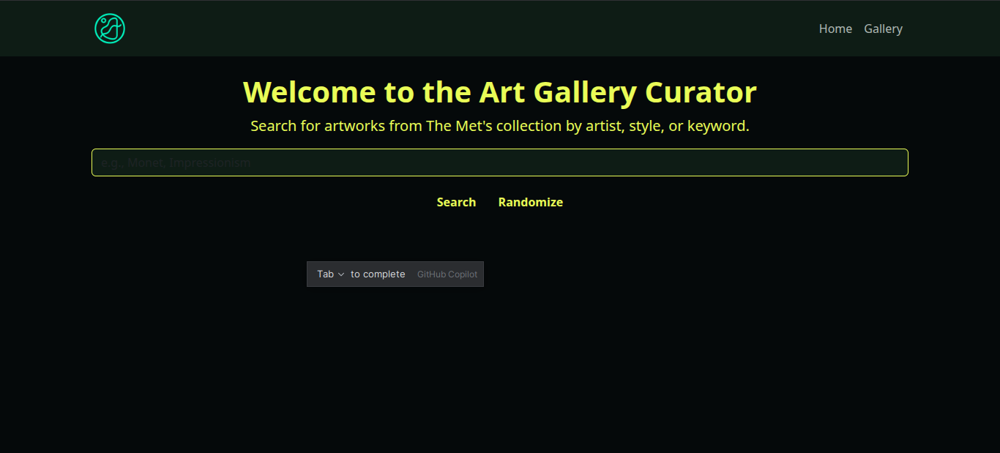
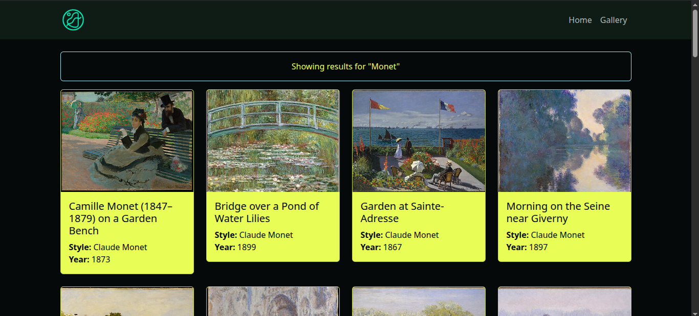

# Art Gallery Curator

This is a Flask-based web application that scrapes artwork from The Metropolitan Museum of Art's collection and curates a personalized gallery based on user search query.

## Features
- Search for artworks by artist, style, or keyword.
- Scrape artwork details (title, image, style, year) from The Met's website.
- Store artworks in a SQLite database.
- Display the scraped artworks in a web gallery interface.

## Setup
1. Clone the repository:
   ```bash
   https://github.com/Takashi-exe/GalleryCurate.git
   cd GalleryCurate
   ```
2. Create a virtual environment and install dependencies:
   ```bash
   python -m venv venv
   source .venv/bin/activate  # On Windows: venv\Scripts\activate
   pip install -r requirements.txt
   ```
3. Run the application:
   ```bash
   python run.py
   ```
4. Open `http://localhost:5000` in your browser.

## Usage
- On the home page, enter a search term (e.g., "Monet", "Mona Lisa").
- Click "Search" to scrape and display matching artworks.

  -    Alternatively, you can randomly search by clicking the "Randomize" button

## Notes
- Images are sourced directly from The Met's website; ensure you have a good internet connection.
- The application uses SQLite for local storage of artwork data.
- The application is designed for educational purposes and may not handle all edge cases in scraping.

## Screenshots



